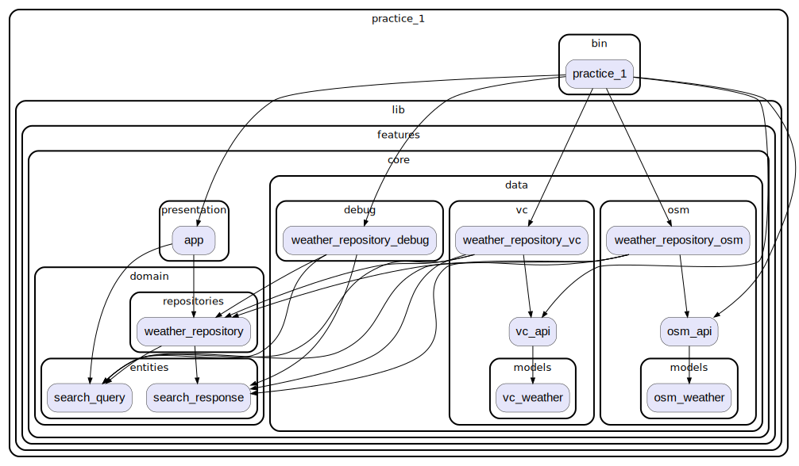

## A sample command-line application providing basic argument parsing with an entrypoint in `bin/`.

В приложении используется [visualcrossing](https://www.visualcrossing.com/) API  для получения погоды.

### Инструкция для получения ключа:
- зарегестрироваться на [сайте](https://www.visualcrossing.com/sign-up)
- ключ будет находиться в профиле в поле `</>Key`

### Погода по координатам
Обе реализации repository (OpenWeatherMap и VisualCrossing) поддерживают получение погоды как по городу, так и по координатам (широте и долшоте).

### Граф зависимостей
